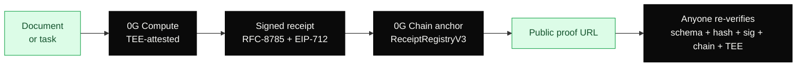
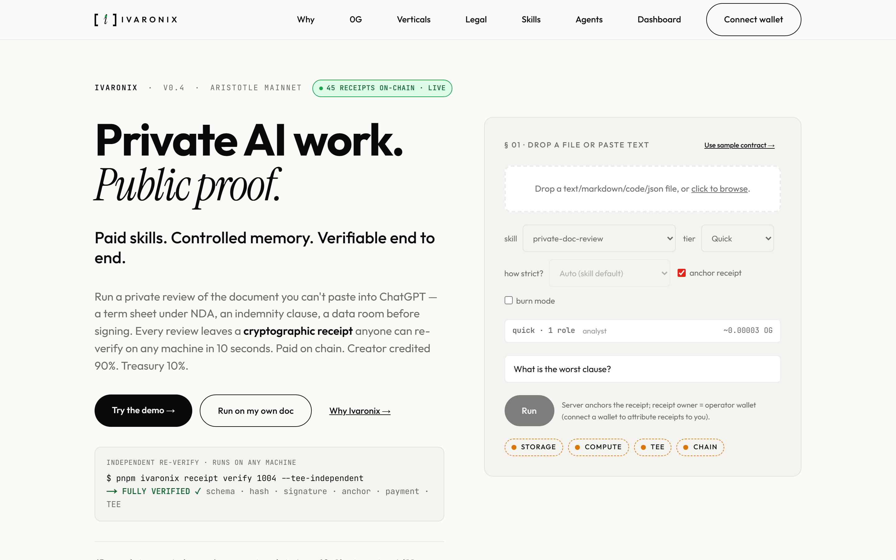
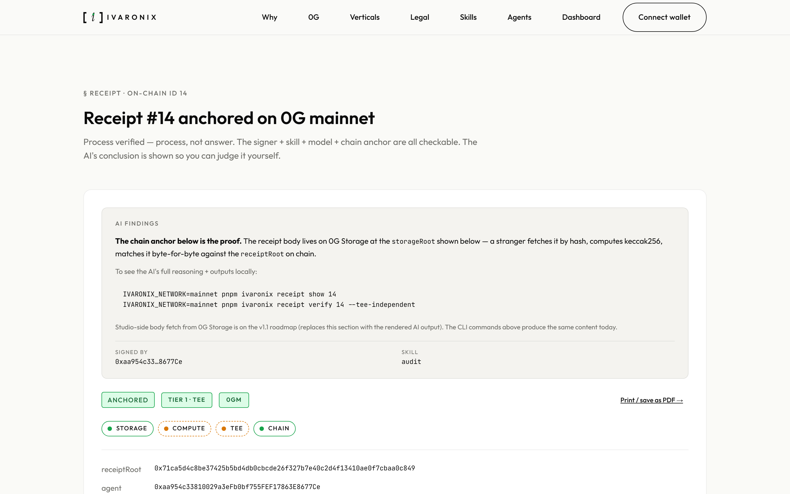
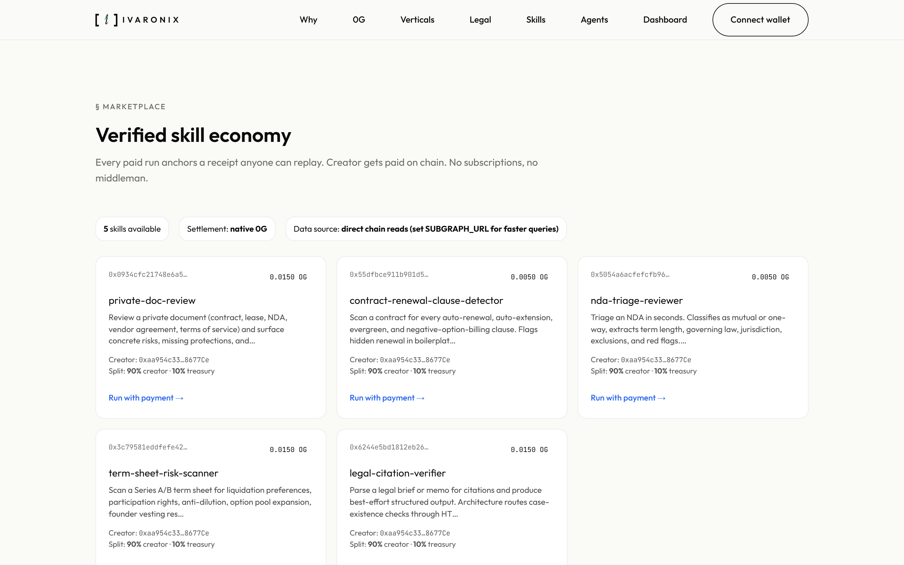
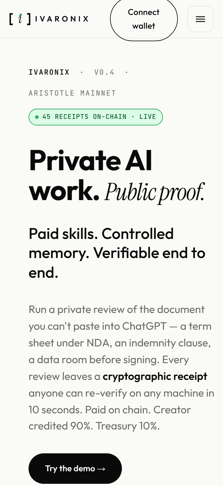
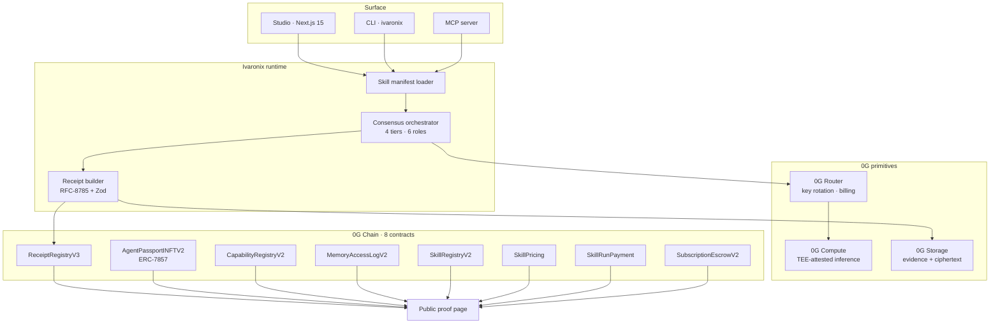
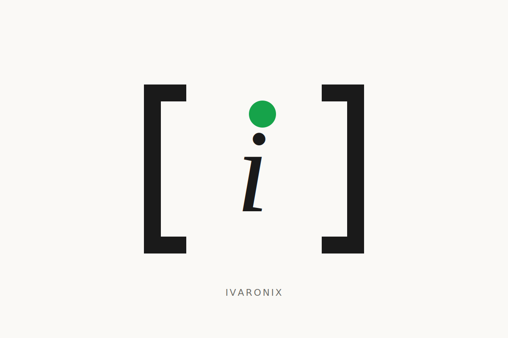

<div align="center">


### Private AI work. Public proof.

Every AI review leaves a signed, chain-anchored receipt — independently re-verifiable by anyone, on any machine, in 10 seconds, without an account.

[](https://chainscan.0g.ai/address/0xCE35aF8D75ffB24BC1671Ca9F0CF293D82737297)
[](https://chainscan-galileo.0g.ai/address/0x7396D536594e2BE833070c7EB441A10906046257)
[](contracts/test/)<!-- numbers-bare:allow: shields.io badge URL requires literal value; numbers.json contracts.foundryTests is the SoT -->
[](docs/numbers.json)
[](LICENSE)

[**Live site**](https://www.ivaronix.xyz) · [Reviewer replay](#reviewer-replay-path) · [Whitepaper (PDF)](Ivaronix_Whitepaper.pdf) · [Pitch deck (PDF)](Ivaronix_Pitch_Deck.pdf)

</div>

---

## What it is

Ivaronix is a cognitive infrastructure layer on 0G. It runs specialist AI reviews — contract analysis, NDA triage, legal-citation verification, term-sheet risk scanning — inside TEE-attested 0G Compute, and emits a receipt for every action that a third party can verify on a clean machine, in any of three languages, without trusting Ivaronix at all.

The receipt is the product. The model is interchangeable. The chain is the source of truth.



---

## See it on chain

| Home · live mainnet | Receipt #14 proof page |
|---|---|
|  |  |
| **Skill marketplace** | **Mobile** |
|  |  |

Captured live from <https://www.ivaronix.xyz>. Refresh with `pnpm exec tsx scripts/diag/capture-readme-prod.ts`.

---

## Quick start

Three shell commands, two minutes, no wallet, no account.

```bash
# 1 · Clone and install
git clone https://github.com/Pratiikpy/ivaronix.git && cd ivaronix
pnpm install

# 2 · Verify a receipt anchored from another machine, against the live chain
pnpm ivaronix receipt verify 1644
# →  ANCHORED ✓   (schema · hash · signature · chain anchor)

# 3 · Add the full TEE re-attestation against the live 0G Compute provider
pnpm ivaronix receipt verify 74 --tee-independent
# →  FULLY VERIFIED ✓   (5 of 5: schema · hash · signature · chain · TEE)
```

That is the load-bearing claim of the product — a stranger, on a different machine, with no credentials, re-runs the five checks and gets the same answer the original signer would.

---

## Reviewer replay path

> Every artifact below is a real on-chain record at submission time. No mocks.

| Want to see | Open this |
|---|---|
| Five-step verifier in action | `pnpm ivaronix receipt verify 74 --tee-independent` |
| Same flow against mainnet | `pnpm ivaronix receipt verify 21 --network mainnet --tee-independent` |
| Live product surface | <https://www.ivaronix.xyz> |
| Technical whitepaper (PDF) | [Ivaronix_Whitepaper.pdf](Ivaronix_Whitepaper.pdf) |
| Pitch deck (PDF) | [Ivaronix_Pitch_Deck.pdf](Ivaronix_Pitch_Deck.pdf) |
| Receipt registry on chainscan | [`0xCE35aF8D75ffB24BC1671Ca9F0CF293D82737297`](https://chainscan.0g.ai/address/0xCE35aF8D75ffB24BC1671Ca9F0CF293D82737297) |

Faucet (testnet): <https://faucet.0g.ai> · roughly 0.5 OG covers an afternoon of demo runs; a single anchored receipt costs about 0.0001 OG.

---

## Why this exists

Professional AI adoption is moving fast. Roughly a quarter of legal organisations now use generative AI in their day-to-day work, up from one in seven the year before ([Thomson Reuters, 2025](https://www.thomsonreuters.com/en/press-releases/2025/april/from-incubation-to-integration-generative-ai-adoption-nearly-doubles-as-professional-services-reach-crossroads)). The EU AI Act's record-keeping mandate (Article 12) enters full application on **2 August 2026** for high-risk systems ([artificialintelligenceact.eu](https://artificialintelligenceact.eu/article/12/)).

The default consumer AI surface gives a user no cryptographic record of which model ran, what data was touched, or whether the answer was edited afterward. The audit log, when it exists at all, is controlled by the same vendor being audited.

Ivaronix makes the audit log a public good. The receipt is signed by an on-chain identity, anchored on a public registry, and re-verifiable end-to-end with one command. The vendor cannot retroactively change what was said.

**Target user.** The deal lawyer scanning a contract before signing. The founder reviewing a vendor agreement. The analyst sweeping a private data room. Anyone whose work demands an AI second opinion and an audit trail other people can verify.

---

## System architecture



The five-step verification chain — `schema → hash → signature → chain anchor → TEE re-attest` — is the load-bearing claim of the whole product. Step 5 (`broker.processResponse` against the live 0G Compute provider) is what makes the receipt verifiable to a third party weeks after the original inference.

Canonical-hash spec in [docs/HASH_FUNCTION.md](docs/HASH_FUNCTION.md). Receipt schema reference in [docs/RECEIPT_SCHEMA.md](docs/RECEIPT_SCHEMA.md).

---

## 0G primitives in use

Five live today, one on the roadmap. We do not claim integration we have not shipped.

| Primitive | Where Ivaronix uses it | User-visible value | Source |
|---|---|---|---|
| **0G Chain** | EIP-712 typed-data anchoring on `ReceiptRegistryV3` with per-agent monotonic nonces. Anchors passport mints, capability grants, memory access logs, skill registrations, subscription escrow. | A verification two years from now produces the same answer as a verification ten seconds after the run. | [`@ivaronix/og-chain`](packages/og-chain/) |
| **0G Compute** | The specialist model runs inside a TEE on 0G Compute. After the run, `broker.processResponse` is re-invoked from any machine to confirm attestation against the live network. | `verificationMethod: 'compute_sdk_process_response'` is an honest claim any stranger can re-check. The load-bearing step. | [`@ivaronix/og-router`](packages/og-router/) |
| **0G Storage** | Encrypted blob (Burn Mode) and signed receipt JSON live on 0G Storage. Storage root recorded inside the receipt; anyone can fetch the ciphertext and confirm it matches. | Evidence is content-addressed on infrastructure no single party controls — what EU AI Act Article 12 expects from a non-operator-controlled record. | [`@ivaronix/og-storage`](packages/og-storage/) |
| **0G Router** | Routes inference to 0G Compute providers with multi-credential rotation and a three-mode failure taxonomy (`'402'` permanent · `'auth'` permanent · `'429'` transient). | A reviewer can read the receipt body and see exactly how the work was billed, by which provider, with which model. | [`@ivaronix/og-router/keyring`](packages/og-router/src/keyring.ts) |
| **0G Agent ID (ERC-7857)** | `AgentPassportINFTV2` mints a soulbound INFT per agent — trust score, receipt count, violation history. Every receipt is bound to a passport tokenId. | Buyers can inspect an agent's on-chain track record before purchasing a skill run. Receipt signer is recovered and matched against the passport owner on chain. | [`AgentPassportINFTV2.sol`](contracts/src/AgentPassportINFTV2.sol) |
| **0G DA** *(roadmap)* | Receipt-batch dispersal once 0G ships a public DA endpoint. Schema slot `og.da.batched` reserved (default `false`); v1.1 wires it without breaking byte-equality of current receipts. | High-volume archival without per-receipt anchor cost. | [docs/0G_DA_INTEGRATION.md](docs/0G_DA_INTEGRATION.md) |

---

## By the numbers

Refreshed against the live chain via `pnpm numbers:refresh` · source of truth: [`docs/numbers.json`](docs/numbers.json).

| Metric | Value | Where to look |
|---|---|---|
| Receipts anchored | **<!-- numbers:auto:receipts.total -->1737<!-- /numbers:auto:receipts.total -->+ testnet** · **<!-- numbers:auto:mainnet.receiptsAnchored -->22<!-- /numbers:auto:mainnet.receiptsAnchored --> mainnet** | live `nextId()` on V1+V2+V3 |
| Receipt types | **<!-- numbers:auto:receiptTypes.count -->13<!-- /numbers:auto:receiptTypes.count -->** | `packages/core/src/types.ts` |
| Contracts deployed | **<!-- numbers:auto:contracts.deployed -->15<!-- /numbers:auto:contracts.deployed --> testnet** · **<!-- numbers:auto:mainnet.deployedContractsToday -->10<!-- /numbers:auto:mainnet.deployedContractsToday --> mainnet** | [deployed contracts](#deployed-contracts) |
| Foundry tests | **<!-- numbers:auto:contracts.foundryTests -->227<!-- /numbers:auto:contracts.foundryTests --> passing** | `cd contracts && forge test` |
| Workspace typecheck-clean | **<!-- numbers:auto:packages.typecheckClean -->21<!-- /numbers:auto:packages.typecheckClean --> packages** | `pnpm -r typecheck` |
| Skills (first-party + catalog) | **<!-- numbers:auto:skills.firstParty -->10<!-- /numbers:auto:skills.firstParty --> + <!-- numbers:auto:skills.vendored -->150<!-- /numbers:auto:skills.vendored --> = <!-- numbers:auto:skills.catalogTotal -->160<!-- /numbers:auto:skills.catalogTotal -->** | `seed-skills/` |
| 0G primitives integrated | **5** (Chain · Compute · Storage · Router · Agent ID) | per-module table above |
| Polyglot canonical hash | **<!-- numbers:auto:polyglotHash.languages -->3<!-- /numbers:auto:polyglotHash.languages --> languages, byte-equal** | TS + Python + Rust, 29 vectors on every PR |
| Networks | Galileo testnet · Aristotle mainnet | chainIds 16602 + 16661 |

---

## Reproduction

Tested on a clean macOS or Linux machine. Around five minutes including `pnpm install`.

### Prerequisites

```bash
node --version    # v20.x or v22.x
pnpm --version    # 9.x or 10.x
# Foundry (optional, for the 227-test contract suite)
```

### Replay an existing anchored receipt

```bash
git clone https://github.com/Pratiikpy/ivaronix.git && cd ivaronix
pnpm install

# Schema · hash · signature · chain anchor (no TEE)
pnpm ivaronix receipt verify 1644
#  →  ANCHORED ✓

# Add TEE re-attestation against the live 0G Compute provider
pnpm ivaronix receipt verify 74 --tee-independent
#  →  FULLY VERIFIED ✓
```

When the live Compute provider's TEE channel is temporarily unreachable, the CLI returns ANCHORED with an amber banner, exit code 1. The first four checks pass deterministically; the fifth degrades honestly when the network can't be reached. No fake green.

### Anchor a fresh receipt of your own

```bash
cp .env.example .env
# Fill: IVARONIX_ROUTER_KEY, IVARONIX_SIGNER_KEY
# Testnet faucet: https://faucet.0g.ai

pnpm ivaronix demo
#  →  anchors one real receipt on Galileo testnet
#  →  prints /r/<id>, chainscan tx link, and the verify command
```

Higher tiers run additional roles:

```bash
pnpm ivaronix demo --tier standard      # 3 roles · analyst + critic + judge
pnpm ivaronix demo --tier high-stakes   # 5 roles
pnpm ivaronix demo --tier audit         # 6 roles, includes red-team-critic
```

For sensitive input, encrypt it before the run:

```bash
pnpm ivaronix doc ask contract.pdf "find risky clauses" \
  --skill private-doc-review --burn
#  →  AES-256-GCM session-key encryption, key destroyed post-anchor,
#     keyFingerprint captured in the receipt body
```

### Open the Studio surface

```bash
pnpm --filter @ivaronix/studio dev
#  →  http://localhost:3300
```

### Run the contract test suite

```bash
cd contracts && forge test
#  →  227 tests passing across 15 contracts
```

---

## Reviewer notes

### Network reference

| | Galileo testnet | Aristotle mainnet |
|---|---|---|
| Chain ID | `16602` | `16661` |
| RPC | `https://evmrpc-testnet.0g.ai` | `https://evmrpc.0g.ai` |
| Explorer | `https://chainscan-galileo.0g.ai` | `https://chainscan.0g.ai` |
| Faucet | `https://faucet.0g.ai` (free, no auth) | source from a CEX or 0G bridge |
| Live contracts | <!-- numbers:auto:contracts.deployed -->15<!-- /numbers:auto:contracts.deployed --> | <!-- numbers:auto:mainnet.deployedContractsToday -->10<!-- /numbers:auto:mainnet.deployedContractsToday --> (deployed 2026-05-15) |

### Test account

The deployer wallet `0xaa954c33810029a3eFb0bf755FEF17863E8677Ce` is funded on both networks. Reviewers can either reuse it (inherits passport history — testnet tokenId 1, mainnet tokenId 2) or generate a fresh wallet (`cast wallet new`), fund via the faucet, and mint a new passport with `pnpm ivaronix passport mint`.

For mainnet TEE re-verification, the deployer's first call on a fresh shell needs a one-time Compute provider acknowledgement plus a small ledger deposit (≈0.001 OG). Helper scripts under `scripts/mainnet/` handle this: `discover-compute-providers.ts` lists registered TEE providers (the sovereign 0GM-1.0-35B-A3B provider at `0x4870CbC4…` is canonical); `deposit-compute-ledger.ts` deposits the broker ledger fee. Without these, the first `--tee-independent` call returns ANCHORED with an amber banner instead of FULLY VERIFIED — the verifier degrades honestly rather than failing silently.

### Canonical demo receipts

| Receipt | Network | Type | Replay command |
|---|---|---|---|
| `1644` | Galileo | `doc_ask` · TIER 1 TEE | `pnpm ivaronix receipt verify 1644` |
| `74` | Galileo | `doc_ask` · TIER 1 TEE | `pnpm ivaronix receipt verify 74 --tee-independent` |
| `21` | Aristotle | `doc_ask` · TIER 1 TEE — signed by the sovereign 0GM-1.0-35B-A3B provider | `pnpm ivaronix receipt verify 21 --network mainnet --tee-independent` |

If the TEE channel is unreachable at the moment a reviewer runs `--tee-independent`, the first four checks still pass and the CLI returns ANCHORED with an amber banner. By design — honesty beats fake green.

### Rate-limit caveats

- **0G Router** caps requests at roughly 30 per minute per credential. The `Keyring` rotates across multiple credentials when configured.
- **Public Studio proof pages** (`/r/<id>`) are read-only and have no rate limit.
- **`broker.processResponse`** for TEE re-verify works against receipts anchored within roughly 30 days. Older receipts return ANCHORED (the provider rotates attestation history).

---

## Tier 1 vs Tier 2 — honest disclosure

Every Ivaronix receipt is one of:

| Tier | Compute | Storage proof | Chain anchor | Re-verify CLI |
|---|---|---|---|---|
| **TIER 1 · TEE** (green) | TEE-attested 0G Compute | `evidenceRoot` on 0G Storage | yes | `--tee-independent` returns **FULLY VERIFIED ✓** |
| **TIER 2 · EXTERNAL** (amber) | NVIDIA NIM / Gemini / OpenAI / Ollama | optional | yes | returns **ANCHORED** (not FULLY VERIFIED) |

The `/r/<id>` proof page never claims compute integrity it cannot back. A TIER 2 receipt renders an explicit *"verifies storage integrity ✓ · verifies compute integrity ⚠ external provider"* line. Storage-integrity and compute-integrity are separate claims; the page labels each one.

---

## Shipped today vs queued for v1.1

### Shipped on both networks

- 13-type receipt schema with RFC-8785 canonical hash (TS / Python / Rust, byte-equal across all three, checked on every PR)
- `ReceiptRegistryV3` EIP-712 typed-data anchoring with per-agent monotonic nonces
- Independent TEE re-verification via `broker.processResponse`
- `AgentPassportINFTV2` (ERC-7857) — trust score, receipt count, violation history
- Consensus mode — 6 roles, 4 tiers (`quick` · `standard` · `high-stakes` · `audit`), Jaccard + cosine convergence scoring
- Burn mode — AES-256-GCM session-key encryption, key destroyed post-anchor, `keyFingerprint` captured before zeroing
- `SkillRegistryV2` marketplace primitive with `og.creator.fee_split` recorded on every receipt body
- <!-- numbers:auto:skills.firstParty -->10<!-- /numbers:auto:skills.firstParty --> first-party skills + <!-- numbers:auto:skills.vendored -->150<!-- /numbers:auto:skills.vendored --> ported skills (<!-- numbers:auto:skills.catalogTotal -->160<!-- /numbers:auto:skills.catalogTotal --> total)
- Studio (Next.js 15, SIWE session auth, mobile + desktop), CLI (`ivaronix(1)`), MCP server, IETF AAT export

### Queued for v1.1

- **Live OG fee settlement.** `SkillRunPayment` is deployed and exercised end-to-end in CLI flow; wiring it into the Studio run path so OG transfers at 90/10 split happen atomically inside every marketplace purchase is the v1.1 headline. Today, the declared fee split is recorded on every receipt body and is enforceable off-chain against the receipt; live settlement adds the on-chain transfer.
- **0G DA integration.** Schema slot `og.da.batched` reserved; integration lands when 0G ships a public DA disperser endpoint.
- **Multi-agent receipt chains.** Single receipt spanning a chain of delegations, each leg signed by its own passport.
- **ZK receipt compression.** SNARK proving receipt validity without revealing content — privacy-preserving compliance reporting.

---

## Polyglot canonical hash — RFC-8785

Three reference implementations of the receipt hash, byte-equal across all three on every PR:

- **TypeScript** · [`packages/core/src/jcs.ts`](packages/core/src/jcs.ts) · 17 self-tests
- **Python** · [`scripts/verifier-py/`](scripts/verifier-py/) · 14 self-tests
- **Rust** · [`ivaronix-verifier-rs/`](ivaronix-verifier-rs/) · 11 self-tests · `cargo install ivaronix-verifier`

CI runs [`.github/workflows/jcs-roundtrip.yml`](.github/workflows/jcs-roundtrip.yml) on every push: each language hashes the same 29 vectors; `scripts/verifier-py/cross_check.py` asserts byte-equality across all three. The merge is blocked on any divergence.

"Re-verify on any machine, in any language" is only true if the canonical hash is language-independent. RFC-8785 (JSON Canonicalisation Scheme) is the spec; [`docs/HASH_FUNCTION.md`](docs/HASH_FUNCTION.md) is the design doc, including the `schemaVersion` migration plan so v1 and v2 receipts coexist forever.

---

## Deployed contracts

### Aristotle mainnet · chainId 16661

<!-- numbers:auto:mainnet.deployedContractsToday -->10<!-- /numbers:auto:mainnet.deployedContractsToday --> contracts deployed on **2026-05-15**. <!-- numbers:auto:mainnet.receiptsAnchored -->22<!-- /numbers:auto:mainnet.receiptsAnchored --> receipts anchored on `ReceiptRegistryV3` + `ReceiptRegistryV2`, spanning all <!-- numbers:auto:receiptTypes.count -->13<!-- /numbers:auto:receiptTypes.count --> receipt-type slots. Deployer wallet `0xaa954c33810029a3eFb0bf755FEF17863E8677Ce`.

<!-- contracts:auto:mainnet:start -->
| Contract              | Address                                                                                                                                            |
|-----------------------|----------------------------------------------------------------------------------------------------------------------------------------------------|
| `AgentPassportINFTV2`  | [`0x5D724659A7d4B0B0917F5DAe9579423D2c85a6Ad`](https://chainscan.0g.ai/address/0x5D724659A7d4B0B0917F5DAe9579423D2c85a6Ad) |
| `CapabilityRegistryV2` | [`0x41fEad4b86DE042845D25Be71aae857E19a8089E`](https://chainscan.0g.ai/address/0x41fEad4b86DE042845D25Be71aae857E19a8089E) |
| `Erc7857Verifier`      | [`0x97376C6f0BE0Ee08AA34C4cAcdbDeC2183e7743c`](https://chainscan.0g.ai/address/0x97376C6f0BE0Ee08AA34C4cAcdbDeC2183e7743c) |
| `MemoryAccessLogV2`    | [`0xA2c3420242aE2BdD7e0970B1DfB28b3055DC4E65`](https://chainscan.0g.ai/address/0xA2c3420242aE2BdD7e0970B1DfB28b3055DC4E65) |
| `ReceiptRegistryV2`    | [`0x27a54F64F3A8578B39fE1E61dF7014813F325adf`](https://chainscan.0g.ai/address/0x27a54F64F3A8578B39fE1E61dF7014813F325adf) |
| `ReceiptRegistryV3`    | [`0xCE35aF8D75ffB24BC1671Ca9F0CF293D82737297`](https://chainscan.0g.ai/address/0xCE35aF8D75ffB24BC1671Ca9F0CF293D82737297) |
| `SkillPricing`         | [`0x08d25653638c3ed40C3b82840fA20CAe9c94563E`](https://chainscan.0g.ai/address/0x08d25653638c3ed40C3b82840fA20CAe9c94563E) |
| `SkillRegistryV2`      | [`0x080f87A9E93e9bd0a9e0eB94F97123bf333b1Dde`](https://chainscan.0g.ai/address/0x080f87A9E93e9bd0a9e0eB94F97123bf333b1Dde) |
| `SkillRunPayment`      | [`0xf8085B43a08e957Fea157394dbB0d3EB76A1cD6A`](https://chainscan.0g.ai/address/0xf8085B43a08e957Fea157394dbB0d3EB76A1cD6A) |
| `SubscriptionEscrowV2` | [`0x937cfE76dEdB25CCf6c7C56fF16F53270794311e`](https://chainscan.0g.ai/address/0x937cfE76dEdB25CCf6c7C56fF16F53270794311e) |
<!-- contracts:auto:mainnet:end -->

Sample anchor transactions any reviewer can replay without auth:

- Receipt 0 · `quick` tier · [`0xd9a48ded…`](https://chainscan.0g.ai/tx/0xd9a48dedd80b88f166da56988c6b3923925476491eb6805dd6e87e0d351d4482)
- Receipt 1 · `standard` 3-role · [`0xbc40fd41…`](https://chainscan.0g.ai/tx/0xbc40fd41c0ff4af78af91dcd598d3618b9c8bd7995069143e58d46c1886e8743)
- Receipt 2 · `high-stakes` 5-role · [`0x280d4548…`](https://chainscan.0g.ai/tx/0x280d45489569a5ee5c927f064e26465857e54f0b8dd35d09678dd8938c07ac29)

### Galileo testnet · chainId 16602

<!-- numbers:auto:contracts.deployed -->15<!-- /numbers:auto:contracts.deployed --> contracts live, feeding Studio + CLI + MCP. V1 contracts remain live so historical receipts stay verifiable; V2/V3 are canonical for new writes.

<!-- contracts:auto:start -->
| Contract              | Address                                                                                                                                            |
|-----------------------|----------------------------------------------------------------------------------------------------------------------------------------------------|
| `AgentPassportINFT`    | [`0x08d25653638c3ed40C3b82840fA20CAe9c94563E`](https://chainscan-galileo.0g.ai/address/0x08d25653638c3ed40C3b82840fA20CAe9c94563E) — stays live for 4 minted passports (tokenIds 1-4) |
| `AgentPassportINFTV2`  | [`0x85e9dD63155836a9BF31F579BFC3a8eb2B46494d`](https://chainscan-galileo.0g.ai/address/0x85e9dD63155836a9BF31F579BFC3a8eb2B46494d) — authorizedRecorders-only with ReceiptRegistryV2 cross-check and a ±100 trustS… |
| `CapabilityRegistry`   | [`0x3783f3c4834fCCBD553860e15c64C7E052646a8D`](https://chainscan-galileo.0g.ai/address/0x3783f3c4834fCCBD553860e15c64C7E052646a8D) — stays live for any existing grants |
| `CapabilityRegistryV2` | [`0x1351CD87360f0366D0A0068164e606B3c320F3E1`](https://chainscan-galileo.0g.ai/address/0x1351CD87360f0366D0A0068164e606B3c320F3E1) — Private reverse indexes close a social-graph leak; authorizedRelayers gate on… |
| `Erc7857Verifier`      | [`0xEAd66Cb90B681720f3aab52d86c289E21106d938`](https://chainscan-galileo.0g.ai/address/0xEAd66Cb90B681720f3aab52d86c289E21106d938) — V1 verifier reused by AgentPassportINFTV2 |
| `MemoryAccessLog`      | [`0xEe1aDFe76785377C4430B1325d86E58A6eC92119`](https://chainscan-galileo.0g.ai/address/0xEe1aDFe76785377C4430B1325d86E58A6eC92119) — stays live for any existing log entries (chain history immutable) |
| `MemoryAccessLogV2`    | [`0xCbfE1f526483283Bba80c2Bed3622a56904bF96d`](https://chainscan-galileo.0g.ai/address/0xCbfE1f526483283Bba80c2Bed3622a56904bF96d) — logAccess enforces msg |
| `ReceiptRegistry`      | [`0x97376C6f0BE0Ee08AA34C4cAcdbDeC2183e7743c`](https://chainscan-galileo.0g.ai/address/0x97376C6f0BE0Ee08AA34C4cAcdbDeC2183e7743c) — stays live for the existing anchored receipts (chain history immutable; curre… |
| `ReceiptRegistryV2`    | [`0xf675d4183b34fe8d1981FA9c117065aAcff690ab`](https://chainscan-galileo.0g.ai/address/0xf675d4183b34fe8d1981FA9c117065aAcff690ab) — EIP-712 anchor signature recovery; agentAddress is the recovered signer, not msg |
| `ReceiptRegistryV3`    | [`0x7396D536594e2BE833070c7EB441A10906046257`](https://chainscan-galileo.0g.ai/address/0x7396D536594e2BE833070c7EB441A10906046257) — Admits receipt-type slots 10 (doc_room_create), 11 (doc_room_read), 12 (memor… |
| `SkillPricing`         | [`0xc3369C9BD74D81E9c7226e5fc9427D19c12B718F`](https://chainscan-galileo.0g.ai/address/0xc3369C9BD74D81E9c7226e5fc9427D19c12B718F) — Mutable per-skill pricing (priceWei + creator/treasury bps) gated by SkillReg… |
| `SkillRegistry`        | [`0xf8894Ce4FFc7C594976d5Eaca38d8FE6DB4820a1`](https://chainscan-galileo.0g.ai/address/0xf8894Ce4FFc7C594976d5Eaca38d8FE6DB4820a1) — stays live for existing skill registrations (chain history immutable) |
| `SkillRegistryV2`      | [`0xF05113E83146160024326ff30979c57f5adc2193`](https://chainscan-galileo.0g.ai/address/0xF05113E83146160024326ff30979c57f5adc2193) — Constructor pre-reserves 6 first-party skill IDs (private-doc-review, github-… |
| `SkillRunPayment`      | [`0x9eA5FDba913AC94dA8833Fee21F2832827950A5C`](https://chainscan-galileo.0g.ai/address/0x9eA5FDba913AC94dA8833Fee21F2832827950A5C) — Per-skill creator/treasury bps fee-split with pull-pattern withdrawals, lifet… |
| `SubscriptionEscrowV2` | [`0x74235b707194c4cc3DDb717B6D95595e8A82B7F5`](https://chainscan-galileo.0g.ai/address/0x74235b707194c4cc3DDb717B6D95595e8A82B7F5) — cancelGraceSeconds window between agent-initiated cancel and EXPIRED status c… |
<!-- contracts:auto:end -->

---

## What makes it different

- **Receipts are independently re-verifiable on a clean machine.** One command runs all five checks — schema, hash, signature, chain anchor, live TEE re-attestation — against the public 0G chain. No account. No wallet. No Ivaronix server.
- **The honesty layer is structural.** TIER 1 and TIER 2 are separately labelled on every receipt page. The CLI never returns FULLY VERIFIED unless the live TEE step actually succeeded. Storage-integrity and compute-integrity are tracked as distinct claims.
- **Polyglot canonical hash.** A reviewer can verify in TypeScript today, in Python or Rust tomorrow, and get byte-equal results across all three. CI blocks merge on divergence across 29 cross-language vectors.
- **Bound to identity.** Every signer is an `AgentPassportINFTV2` (ERC-7857) on-chain identity with public trust accrual. Buyers can see an agent's history before spending OG on a skill run.
- **Built for compliance.** EU AI Act Article 12 expects non-operator-controlled audit logs by August 2026. Ivaronix produces them today.

---

## CLI surface

`ivaronix(1)` is the canonical Ivaronix interface. Twenty-plus commands across receipts, skills, memory, passport, marketplace, demo, and admin. Source under [`apps/cli/src/commands/`](apps/cli/src/commands/).

Most-used commands:

```bash
ivaronix doc ask <file> "<question>" --skill <id>   # one-shot AI review
ivaronix demo --tier audit                          # 6-role consensus
ivaronix receipt show <id>                          # full receipt body
ivaronix receipt verify <id> --tee-independent      # five-step re-verify
ivaronix passport mint                              # mint ERC-7857 INFT
ivaronix skill publish <id>                         # anchor manifest on chain
ivaronix memory remember "<text>" --tags work,legal # encrypted hybrid memory
ivaronix memory grant <addr> --scope memory:work    # CapabilityRegistryV2
```

Receipt anchors are idempotent at the storage and chain layers; a stalled inference call can be re-run without duplicating state.

---

## Memory engine

`MemoryEngine` is an encrypted hybrid memory layer — vector similarity plus FTS keyword search, AES-256-GCM at rest with a fresh per-call nonce. Wired to `CapabilityRegistryV2` for on-chain grants and `MemoryAccessLogV2` for the on-chain access trail. Portable across machines via `memory stream-id` — a deterministic 0G KV stream identifier derived from any wallet.

```bash
ivaronix memory remember "Vendor X has a 90-day notice asymmetry" --tags work,legal
ivaronix memory recall   "asymmetric notice clauses" --top-k 5
ivaronix memory grant    0xPartner --scope memory:work --expires 1735689600
ivaronix memory log      --agent $IVARONIX_WALLET_ADDRESS --limit 10
```

Every memory write anchors a `memory_access` receipt. A memory write isn't just stored — it's attested. The same applies to reads and grants.

Ten sub-commands total: `remember` · `recall` · `forget` · `grant` · `revoke` · `list` · `log` · `log-emit` · `stream-id` · `snapshot`. Studio `/memory` mirrors the surface with SIWE-gated grant management and a real-time event feed from `MemoryAccessLogV2`.

---

## Documentation

| Doc | Purpose |
|---|---|
| [Ivaronix_Whitepaper.pdf](Ivaronix_Whitepaper.pdf) | Technical whitepaper |
| [Ivaronix_Pitch_Deck.pdf](Ivaronix_Pitch_Deck.pdf) | Pitch deck |
| [docs/HASH_FUNCTION.md](docs/HASH_FUNCTION.md) | RFC-8785 canonical hash specification |
| [docs/RECEIPT_SCHEMA.md](docs/RECEIPT_SCHEMA.md) | Receipt field-level reference |
| [docs/MAINNET_READINESS.md](docs/MAINNET_READINESS.md) | Mainnet readiness checklist |
| [docs/CRYPTO_NOTES.md](docs/CRYPTO_NOTES.md) | Threat models for every primitive |
| [docs/PRIVACY_NOTES.md](docs/PRIVACY_NOTES.md) | Operator-as-proxy threat model |
| [docs/SOLIDITY_CHOICES.md](docs/SOLIDITY_CHOICES.md) | Contract design choices and trade-offs |
| [docs/AAT_MAPPING.md](docs/AAT_MAPPING.md) | IETF Agent Audit Trail draft mapping |
| [docs/MARKETPLACE_DESIGN.md](docs/MARKETPLACE_DESIGN.md) | Skill marketplace design |
| [docs/SKILL_PUBLISHING.md](docs/SKILL_PUBLISHING.md) | How to publish a skill |
| [docs/0G_DA_INTEGRATION.md](docs/0G_DA_INTEGRATION.md) | 0G Data Availability integration roadmap |
| [SECURITY.md](SECURITY.md) | Security policy and disclosure |
| [CONTRIBUTING.md](CONTRIBUTING.md) | How to contribute |
| [BRAND.md](BRAND.md) | Brand-asset license (separate from MIT code grant) |
| [CHANGELOG.md](CHANGELOG.md) | Release notes |

---

## License & contact

Code: MIT. Brand assets: see [BRAND.md](BRAND.md) — separate grant for fork and widget-embedding.

Open source at <https://github.com/Pratiikpy/ivaronix>. Security reports via [SECURITY.md](SECURITY.md). Partnership inquiries welcome.

<div align="center">



</div>
