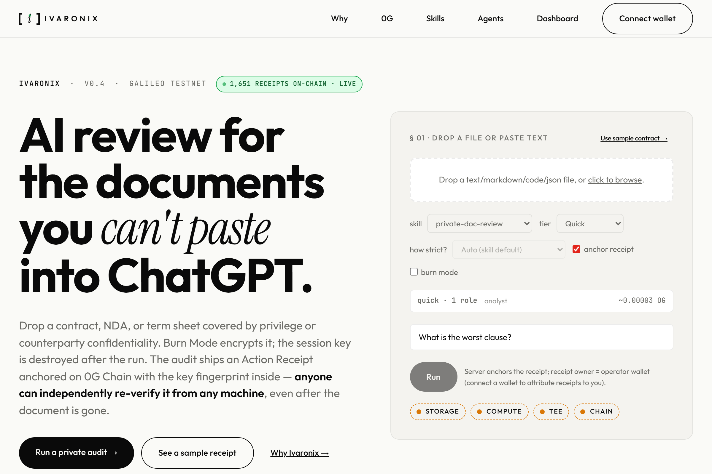
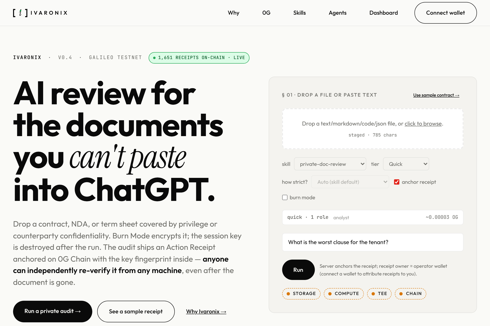
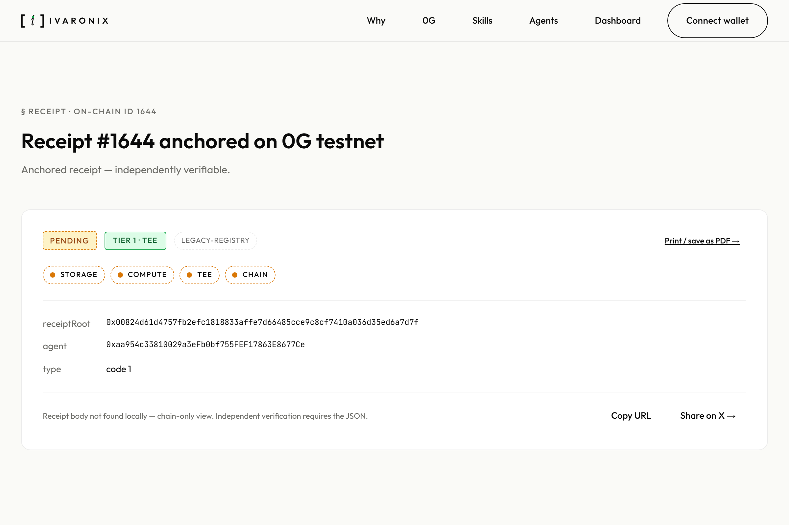
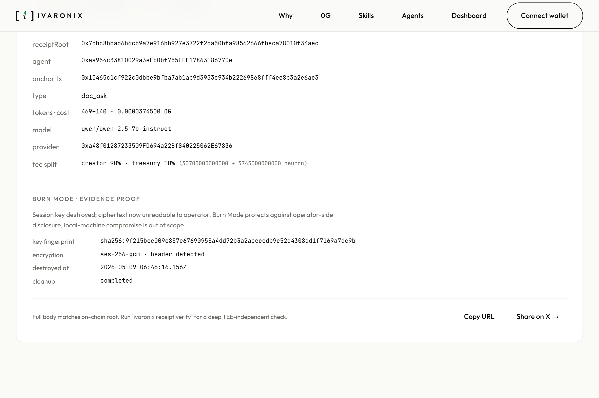
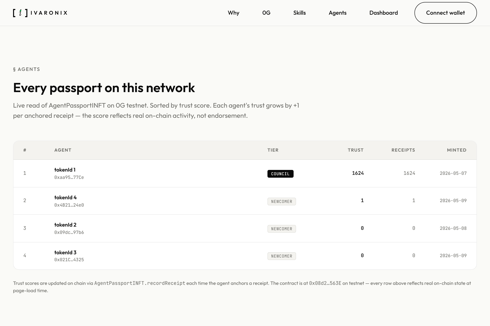
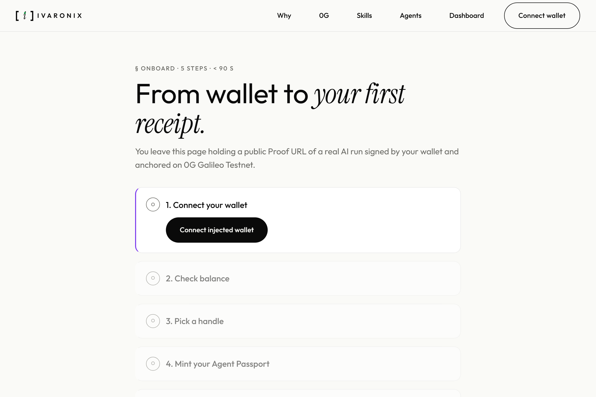

# Ivaronix

> Catch the risks. Keep the receipts.

```text
[ Drop a document ]  ──▶  [ 0G Compute TEE ]  ──▶  [ 0G Chain anchor ]  ──▶  [ Public Proof URL ]
   contract.pdf            specialist runs           receipt signed +          /r/<id> renders
   never leaves            inside attested           hash anchored on          evidence anyone
   unencrypted             hardware enclave          ReceiptRegistryV2         can re-verify
```

## How it works

1. **Drop a document.** Studio's drop-zone or `ivaronix doc ask <file>`.
2. **The specialist runs in a 0G Compute TEE.** Plaintext is invisible outside the run — the Router sees the request, but the inference output never leaves the TEE unencrypted.
3. **A receipt is signed and hashed.** Every claim ties back to verifiable evidence; the receipt's canonical hash is byte-equal across TS / Python / Rust reference implementations.
4. **The receipt anchors on `ReceiptRegistryV2`.** Chain confirms the signer, the hash, and the exact moment the audit happened.
5. **Anyone replays the verification.** From any machine, in any of three languages, without an account.

> AI review for documents you can't paste into ChatGPT. Burn-Mode encrypts; the session key dies after the run. Every audit anchors a verifiable receipt on 0G Chain. Anyone can re-verify it from any machine, in any language.
>
> **Verifiability over volume.**

## Quick start (60 seconds, no wallet)

```bash
git clone https://github.com/Pratiikpy/ivaronix
cd ivaronix && pnpm install
pnpm ivaronix receipt verify 1644
# → ANCHORED ✓ (chain anchor + canonical hash + signature recovery)
```

For TEE re-attestation, add `--tee-independent` against a recent receipt:

```bash
pnpm ivaronix receipt verify <id> --tee-independent
# → FULLY VERIFIED ✓ (also re-runs broker.processResponse against the
#                    original 0G Compute provider — works on receipts
#                    anchored within the last ~30 days; older receipts
#                    stop at ANCHORED because the provider rotates
#                    attestation history)
```

The wedge: this works on a stranger's clean machine, against a receipt anchored by someone else, on testnet, today.

> <!-- numbers:auto:receipts.total -->1651<!-- /numbers:auto:receipts.total -->+ receipts anchored on 0G Galileo Testnet · <!-- numbers:auto:contracts.foundryTests -->173<!-- /numbers:auto:contracts.foundryTests -->/<!-- numbers:auto:contracts.foundryTests -->173<!-- /numbers:auto:contracts.foundryTests --> Foundry tests · <!-- numbers:auto:contracts.deployed -->8<!-- /numbers:auto:contracts.deployed --> deployed contracts (V1 + V2 active) · <!-- numbers:auto:packages.typecheckClean -->21<!-- /numbers:auto:packages.typecheckClean --> workspace packages typecheck-clean. Numbers refreshed via `pnpm numbers:refresh` against the live chain — single source of truth in [`docs/numbers.json`](docs/numbers.json).

## Track 1 (Agentic Infrastructure) · by the numbers

The metrics this product is optimised for. Receipts as the unit of trust, primitives integrated end-to-end, persona-locked use case.

| Metric | Value | Where to look |
|---|---|---|
| Receipt types | **<!-- numbers:auto:receiptTypes.count -->13<!-- /numbers:auto:receiptTypes.count -->** | `packages/core/src/types.ts` enum |
| 0G primitives integrated | **6** | Chain · Compute · Storage · Router · AgentID · Memory KV |
| Skills in catalog | **<!-- numbers:auto:skills.catalogTotal -->156<!-- /numbers:auto:skills.catalogTotal -->** | <!-- numbers:auto:skills.firstParty -->6<!-- /numbers:auto:skills.firstParty --> first-party + <!-- numbers:auto:skills.vendored -->150<!-- /numbers:auto:skills.vendored --> vendored under `seed-skills/` and `apps/cli/.ivaronix/skills/` |
| Receipts anchored on chain | **<!-- numbers:auto:receipts.total -->1651<!-- /numbers:auto:receipts.total -->+** | live `nextId()` on `ReceiptRegistry` + `ReceiptRegistryV2` |
| Foundry tests | **<!-- numbers:auto:contracts.foundryTests -->173<!-- /numbers:auto:contracts.foundryTests -->/<!-- numbers:auto:contracts.foundryTests -->173<!-- /numbers:auto:contracts.foundryTests -->** | full suite green; V1 + V2 + Guard + Capability + Skill + Subscription |
| Deployed contracts | **<!-- numbers:auto:contracts.deployed -->8<!-- /numbers:auto:contracts.deployed -->** | Receipt V1 + V2 · Passport V1 + V2 · Verifier · Capability · Skill · Subscription on Galileo |
| Packages typecheck-clean | **<!-- numbers:auto:packages.typecheckClean -->21<!-- /numbers:auto:packages.typecheckClean -->** | `pnpm -r --filter "@ivaronix/*" run typecheck` green |
| First-party test files | **<!-- numbers:auto:packages.testFiles -->21<!-- /numbers:auto:packages.testFiles -->** | `*.test.ts` under `packages/` + `apps/` (excludes `_design`, `opencode-*`, compiled output) |
| Polyglot canonical hash | **<!-- numbers:auto:polyglotHash.languages -->3<!-- /numbers:auto:polyglotHash.languages --> languages** | TS + Python + Rust byte-equal in `.github/workflows/jcs-roundtrip.yml` (29/29 vectors) |

> Track positioning: Ivaronix targets **Track 1 (Agentic Infrastructure)** as primary and **Track 3 (Agentic Economy)** as automatic-secondary. We do not compete on Track 2 (Verifiable Finance) production-rigor metrics — Aegis Vault holds that bar with 235 Hardhat tests + sealed strategies on mainnet. Track 1 rewards the metric set above.

## Visual tour

Six product surfaces, captured by `pnpm screenshots:refresh` at 1200×800 against a live Studio dev server. Each shot is a real screen, not a mockup. Source script: [`scripts/qa/metamask-e2e/capture-readme-shots.ts`](scripts/qa/metamask-e2e/capture-readme-shots.ts). When the captures haven't been refreshed against the latest deploy, the operator runs `pnpm screenshots:refresh` per the runbook in [USER_TODO §B-V2-23](docs/USER_TODO.md).

A 30-second tour video at [`screenshots/readme/tour.webm`](screenshots/readme/tour.webm) walks the same six surfaces in motion (home → skills → `/r/<id>` → agents → `/0g` → memory). Refresh via `pnpm tour:refresh` against the same dev server (`scripts/qa/metamask-e2e/capture-readme-tour.ts`).

| | | |
|---|---|---|
|  |  |  |
| **Studio home** · hero + live receipt counter rendered from chain | **Run panel** · four-light row mid-flight on a real run | **/r/&lt;id&gt;** · TIER 1 verified, all four lights green |
|  |  |  |
| **Burn Mode** · 256-bit session key + on-chain fingerprint | **/agents** · ERC-7857 Agent Passports with trust scores | **/onboard** · five steps to first share-able receipt |

## Track 3 (Agentic Economy) · by the numbers

Receipt-gated fee splits, on-chain creator wallet, marketplace primitive on every action.

| Primitive | Where it ships | Verify on chain |
|---|---|---|
| `SkillRegistry` (skill catalog + creator + fee-split) | `0xf8894Ce4FFc7C594976d5Eaca38d8FE6DB4820a1` | [chainscan-galileo](https://chainscan-galileo.0g.ai/address/0xf8894Ce4FFc7C594976d5Eaca38d8FE6DB4820a1) |
| `og.creator.fee_split` per skill manifest | `seed-skills/<skill>/SKILL.md` frontmatter | `private-doc-review` 90/10 · `content-pitch-review` 70/30 (per-skill economic policy) |
| Paid creator runs of `private-doc-review` | **36** | `ivaronix skill earn-history private-doc-review` returns chain numbers |
| Creator earnings (testnet) | **0.0018 OG** | exact 90/10 split per receipt, settled on anchor (iter-63 cron refresh · numbers.json B-V2-34 fix queued) |

Why receipt-gated splits, not a static registry? A creator only earns when:
1. The run completes inside a TEE-attested 0G Compute provider, AND
2. The receipt's signature recovers to an `AgentPassport`-resolvable wallet, AND
3. The receipt anchors on `ReceiptRegistryV2` with the correct fee-split block.

No receipt → no payment. No TEE → no green badge. Trustless monetisation, not a self-claimed leaderboard.

## Honest tier disclosure

Every Ivaronix receipt is **TIER 1** (TEE-attested on 0G Compute, rendered green) or **TIER 2** (external provider — NVIDIA NIM / Gemini / OpenAI / Ollama — signed and chain-anchored, rendered amber). We refuse to render an external-provider receipt as if it were TEE-attested.

| Tier | Compute | Storage proof | Chain anchor | Re-verify command |
|---|---|---|---|---|
| **TIER 1** | TEE-attested 0G Compute | `evidenceRoot` on 0G Storage | `ReceiptRegistry` / V2 | `ivaronix receipt verify <id> --tee-independent` returns FULLY VERIFIED ✓ |
| **TIER 2** | External (NIM / Gemini / etc.) | optional | yes | `ivaronix receipt verify <id>` returns ANCHORED (not FULLY VERIFIED) |

The `/r/<id>` proof page never claims compute integrity it can't back: a TIER 2 receipt renders an explicit "verifies storage integrity ✓ · verifies compute integrity ⚠ external provider" line. Storage-integrity and compute-integrity are separate claims and the page labels each one (CLAUDE.md §6).

## What makes Ivaronix different

- **Receipts are independently re-verifiable.** `ivaronix receipt verify <id> --tee-independent` re-runs `broker.processResponse` against the original 0G Compute provider — on any machine, in any of three languages, without an account. A TIER 1 receipt that passes returns `FULLY VERIFIED ✓`.
- **TIER 1 vs TIER 2 is labeled honestly.** Green chip when the inference ran inside a TEE-attested 0G Compute provider; amber chip when it ran on an external provider (NIM / Gemini / etc.). Both are signed and chain-anchored; the page never conflates the two.
- **Receipt hashes are canonical across languages.** The receipt's canonical hash is byte-equal across TypeScript, Python, and Rust reference implementations — checked on every PR (see below). RFC-8785 (JSON Canonicalisation Scheme) is the spec.
- **Creators earn only from receipt-backed runs.** Each skill manifest can declare `og.creator.fee_split`; the split is recorded on the receipt, so a creator's earnings trace back to verifiable executions.
- **Proof links work without an account.** `/r/<id>` renders the four-light evidence row, the TIER chip, the anchor tx link, and the key fingerprint — to anyone, no wallet, no login.

## Polyglot canonical hash · RFC-8785

Three reference implementations of the receipt's canonical hash, byte-equal across all three on every PR:

- **TS reference** · `packages/core/src/jcs.ts` · 17 self-tests
- **Python reference** · `scripts/verifier-py/` · 14 self-tests
- **Rust reference** · `ivaronix-verifier-rs/` · 11 self-tests · `cargo install ivaronix-verifier`

Cross-impl proof runs in `.github/workflows/jcs-roundtrip.yml` on every push: each language hashes the same 29 vectors, `scripts/verifier-py/cross_check.py` asserts byte-equality across all three. The CI workflow blocks merge on any divergence. Go support queued ([USER_TODO §A-V2-K15-Go](docs/USER_TODO.md)).

Why this matters: "re-verify on any machine, in any language" is only true if the canonical hash is language-independent. RFC-8785 (JSON Canonicalisation Scheme) is the spec; `docs/HASH_FUNCTION.md` is the design doc, including the `schemaVersion` migration plan that lets v1 and v2 receipts coexist forever.

## Documentation

> Every depth artifact a careful reviewer would look for. None hidden behind a build step.

- [docs/JUDGE_GUIDE.md](docs/JUDGE_GUIDE.md) · five minutes, three commands, three URLs — the demo path
- [docs/PITCH.md](docs/PITCH.md) · what · who · why now (3-page pitch)
- [docs/MAINNET_READINESS.md](docs/MAINNET_READINESS.md) · 13/13 mainnet-readiness checklist
- [docs/RECEIPT_SCHEMA.md](docs/RECEIPT_SCHEMA.md) · receipt field-level reference
- [docs/HASH_FUNCTION.md](docs/HASH_FUNCTION.md) · RFC-8785 canonical receipt hash spec
- [docs/CRYPTO_NOTES.md](docs/CRYPTO_NOTES.md) · threat models for every primitive (memory AES-GCM, Burn Mode, receipt signing, anchor sigs, capability grants, ERC-7857 attestors)
- [docs/PHASE_B_DISCLOSURES.md](docs/PHASE_B_DISCLOSURES.md) · half-baked surfaces, what we shipped, what's left
- [docs/HALF_BAKED.md](docs/HALF_BAKED.md) · audit ledger from 5 parallel subagents (snapshot frozen 2026-05-09; closures live in `CHANGELOG.md` + `pnpm audit:list`)
- [docs/USER_TODO.md](docs/USER_TODO.md) · operator action list (mainnet redeploy, Vercel deploy, npm publish, etc.)
- [docs/CI_WALLET.md](docs/CI_WALLET.md) · runbook for the chain-smoke CI wallet
- [docs/planning-003.md](docs/planning-003.md) · no-compromise plan with full coverage map
- [docs/PRIVACY_NOTES.md](docs/PRIVACY_NOTES.md) · operator-as-proxy threat model + read-proxy-key mitigation
- [docs/QUALITY.md](docs/QUALITY.md) · evergreen quality philosophy (CLI as gold standard, TIER 1 vs TIER 2 honesty, stop condition)
- [SECURITY.md](SECURITY.md) · what the receipt system defends + what it does NOT (8 specific threats + 5 honest non-defenses · file:line citations)
- [CONTRIBUTING.md](CONTRIBUTING.md) · pre-PR command list, commit conventions, audit-trailer convention, NatSpec discipline
- [BRAND.md](BRAND.md) · brand-asset license (separate from MIT code grant); rules for forks + attribution + widget embedding
- [CHANGELOG.md](CHANGELOG.md) · audit-fix ledger with `Closes audit <ID>` commit trailers (queryable via `pnpm audit:list`)

## Memory primitive · portable, encrypted, on-chain audit trail

`MemoryEngine` is an encrypted hybrid memory layer — vector similarity + FTS keyword, encrypted at rest with AES-256-GCM (fresh per-call nonce) — wired to `CapabilityRegistry` (on-chain access grants) and `MemoryAccessLog` (on-chain access trail). It's portable across machines: `memory stream-id` derives a deterministic 0G KV stream-ID from any wallet, so memory moves without a server-side index.

```bash
# Write an observation to your hybrid memory (encrypted, indexed, optional on-chain log)
ivaronix memory remember "Vendor X's contract has a 90-day notice asymmetry" --tags work,legal

# Recall by hybrid score (vector similarity + FTS keyword)
ivaronix memory recall "asymmetric notice clauses" --top-k 5

# Grant another wallet read access to a scoped slice
ivaronix memory grant 0xPartner --scope "memory:work" --expires 1735689600

# See on-chain access events for your wallet
ivaronix memory log --agent $IVARONIX_WALLET_ADDRESS --limit 10
```

10 sub-commands total: `remember`, `recall`, `forget`, `grant`, `revoke`, `list`, `log`, `log-emit`, `stream-id`, `snapshot`. The `stream-id` command derives a deterministic 0G KV stream-ID from any wallet so memory is portable across machines without a server-side index. Studio `/memory` page mirrors the surface: SIWE-gated, real-time event feed from `MemoryAccessLog`, grant management UI for `CapabilityRegistry`.

Every `memory remember` anchors a `memory_access` receipt on chain (unless `--no-log` is passed). The receipt records the access type plus the encrypted blob's storage root — so a memory write isn't just stored, it's attested. The same applies to reads and grants: each access is a receipt.

## Verify a real receipt right now

Clone, install, run one command — no account, no wallet:

```bash
git clone https://github.com/Pratiikpy/ivaronix.git oglabs && cd oglabs
pnpm install
pnpm --filter @ivaronix/cli exec ivaronix receipt verify 1304 --tee-independent
```

Expected output, when the live 0G Compute provider's TEE channel is reachable:

```
schema PASS · hash PASS · signature PASS → CLAIMED
chain anchor PASS (id=1304 block=1778334585) → ANCHORED
tee:primary PASS                          → via broker.processResponse
Status: → FULLY VERIFIED ✓
```

When the provider's TEE channel is temporarily unreachable (Router rate limit, provider session rotation, transient network), the last two lines look like this:

```
tee:primary error             getting signature error
Status: → ANCHORED (some TEE checks failed)
```

The first four checks — `schema · hash · signature · chain anchor` — are the load-bearing authenticity proof: the receipt body is untampered, the canonical hash recovers, the signature recovers the agent address recorded on the `AgentPassportINFT`, and `ReceiptRegistry` holds the anchor at the given id. `tee:primary` is the additional check that calls back to the live 0G Compute provider — it proves the inference itself ran inside the attested TEE when reachable, and it degrades honestly (not silently) when not.

No account required. No wallet connection. The receipt was anchored on a different machine; you re-run the verify against the public 0G chain. Receipt body is on `/r/1304`; anchor tx on `chainscan-galileo.0g.ai`.

> A global `pnpm install -g @ivaronix/cli` install path lands once `@ivaronix/widget` and `@ivaronix/cli` are npm-published (operator action, tracked in [docs/USER_TODO.md](docs/USER_TODO.md) B-3). Today the repo-clone path above is the only honest entry point — and still verifies a real on-chain receipt in one shell command.

That's the spine. Everything else in this repo exists to make that command produce useful answers about real documents.

## Run a fresh receipt of your own in 30 seconds

```bash
git clone https://github.com/Pratiikpy/ivaronix.git && cd ivaronix
pnpm install
cp .env.example .env   # add your IVARONIX_ROUTER_KEY + IVARONIX_SIGNER_KEY (faucet at faucet.0g.ai is free)
pnpm --filter @ivaronix/cli exec tsx apps/cli/src/bin/ivaronix.ts demo
```

`ivaronix demo` anchors one real receipt on 0G Galileo Testnet (~0.0001 OG, ~3 seconds) and prints three independent proof URLs:

- `/r/<id>` — Studio public proof page (start `pnpm --filter @ivaronix/studio dev` for the UI)
- `chainscan-galileo.0g.ai/tx/<hash>` — third-party explorer
- `ivaronix receipt verify <id> --tee-independent` — your own command, run on your own machine, against the chain

Want a richer view? `demo --tier standard` runs 3-role consensus (analyst/critic/judge); `--tier high-stakes` runs 5 roles. Real disagreement surfaces; the judge synthesis is the receipt body. Drop a sensitive document into `ivaronix doc ask <file> "..." --burn --quick` for AES-256-GCM encrypted evidence + session-key destruction (TIER 1 burn-mode). The bare `ivaronix` invocation drops you into the Ink TUI chat with streaming, tool panels, slash palette, and 19 slash commands; `ivaronix chat-classic` is the readline fallback for SSH / piped workflows.

## Install one of the Ivaronix skills via OpenClaw

Every first-party skill ships with the OpenClaw `metadata.openclaw.install` block already populated. An OpenClaw user can install any of them in one command:

```bash
openclaw skills install Pratiikpy/ivaronix#seed-skills/private-doc-review
openclaw skills install Pratiikpy/ivaronix#seed-skills/0g-integration-auditor
openclaw skills install Pratiikpy/ivaronix#seed-skills/github-audit
openclaw skills install Pratiikpy/ivaronix#seed-skills/plan-step
openclaw skills install Pratiikpy/ivaronix#seed-skills/code-edit
```

The skill's `SKILL.md` declares the exact runtime requirement — `kind: node`, `package: @ivaronix/cli`, `bins: [ivaronix]` — and the env vars it needs (`IVARONIX_SIGNER_KEY`, `IVARONIX_WALLET_ADDRESS`, `IVARONIX_ROUTER_KEY` · legacy aliases `EVM_PRIVATE_KEY`, `EVM_WALLET_ADDRESS`, `ZG_API_SECRET` still resolve). After install, every run produces an Action Receipt anchored on `ReceiptRegistry` (chainId 16602) with creator/treasury fee split per `og.creator.fee_split` (90/10 for `private-doc-review`).

To verify a receipt independently after a skill run:

```bash
ivaronix receipt verify <id> --tee-independent
```

This calls `broker.processResponse` against 0G Compute. If TEE verification passes, the receipt status flips to `→ FULLY VERIFIED ✓` (proven on receipts #994 and #1004). External-provider runs (NVIDIA NIM via `OG_PROVIDER=nvidia`) anchor as TIER 2 with `verificationMethod: external-signed` and render amber on `/r/<id>` per the brand contract — never green-washed.

---

## Phase A · Live testnet (Galileo, chainId 16602)

All <!-- numbers:auto:contracts.deployed -->8<!-- /numbers:auto:contracts.deployed --> contracts deployed and feeding live data into Studio + CLI + MCP:

<!-- contracts:auto:start -->
| Contract              | Address                                                                                                                                            |
|-----------------------|----------------------------------------------------------------------------------------------------------------------------------------------------|
| `AgentPassportINFT`    | [`0x08d25653638c3ed40C3b82840fA20CAe9c94563E`](https://chainscan-galileo.0g.ai/address/0x08d25653638c3ed40C3b82840fA20CAe9c94563E) — stays live for 4 minted passports (tokenIds 1-4) |
| `AgentPassportINFTV2`  | [`0x85e9dD63155836a9BF31F579BFC3a8eb2B46494d`](https://chainscan-galileo.0g.ai/address/0x85e9dD63155836a9BF31F579BFC3a8eb2B46494d) — K-1 + K-4 + K-6 fix |
| `CapabilityRegistry`   | [`0x3783f3c4834fCCBD553860e15c64C7E052646a8D`](https://chainscan-galileo.0g.ai/address/0x3783f3c4834fCCBD553860e15c64C7E052646a8D) |
| `Erc7857Verifier`      | [`0xEAd66Cb90B681720f3aab52d86c289E21106d938`](https://chainscan-galileo.0g.ai/address/0xEAd66Cb90B681720f3aab52d86c289E21106d938) — V1 verifier reused by AgentPassportINFTV2 |
| `MemoryAccessLog`      | [`0xEe1aDFe76785377C4430B1325d86E58A6eC92119`](https://chainscan-galileo.0g.ai/address/0xEe1aDFe76785377C4430B1325d86E58A6eC92119) |
| `ReceiptRegistry`      | [`0x97376C6f0BE0Ee08AA34C4cAcdbDeC2183e7743c`](https://chainscan-galileo.0g.ai/address/0x97376C6f0BE0Ee08AA34C4cAcdbDeC2183e7743c) — stays live for the existing anchored receipts (chain hist… |
| `ReceiptRegistryV2`    | [`0xf675d4183b34fe8d1981FA9c117065aAcff690ab`](https://chainscan-galileo.0g.ai/address/0xf675d4183b34fe8d1981FA9c117065aAcff690ab) — K-2 fix |
| `SkillRegistry`        | [`0xf8894Ce4FFc7C594976d5Eaca38d8FE6DB4820a1`](https://chainscan-galileo.0g.ai/address/0xf8894Ce4FFc7C594976d5Eaca38d8FE6DB4820a1) |
<!-- contracts:auto:end -->

Live data path:

- **Receipts anchored:** read live via `ReceiptRegistry.nextId()` — Studio `/global` + CLI `ivaronix receipt list`.
- **Passport profile:** `AgentPassportINFT.passportOf(wallet)` — `did:0g:passport:0xaa954c33810029a3eFb0bf755FEF17863E8677Ce:1` (tokenId 1, trustScore + receiptCount climbing per anchor).
- **Skill catalog:** <!-- numbers:auto:skills.firstParty -->6<!-- /numbers:auto:skills.firstParty --> first-party skills + <!-- numbers:auto:skills.vendored -->150<!-- /numbers:auto:skills.vendored --> awesome-claude-skills ports = **<!-- numbers:auto:skills.catalogTotal -->156<!-- /numbers:auto:skills.catalogTotal --> skills** discoverable via `ivaronix skill list` and Studio `/skills`.
- **First-party skills published on-chain via `SkillRegistry`:** `0g-integration-auditor`, `github-audit`, `private-doc-review` (v0.1.0 + v0.2.0), `plan-step`, `code-edit`. Each `verify` returns `MATCH` against the local manifestHash.

Run end-to-end on the **public testnet** today:

```bash
# CLI
ivaronix doc ask contract.pdf "find risky clauses" \
  --skill private-doc-review --consensus --burn

# Studio
pnpm --filter @ivaronix/studio dev
# → http://localhost:3300/  drop a file, pick a skill, click Run

# MCP server (Claude Desktop / Cursor / Codex)
pnpm --filter @ivaronix/mcp-server dev
# stdio: tools/list returns ivaronix_ask, verify_receipt, passport_show, …
```

---

## What is Ivaronix?

> **Catch the risks. Keep the receipts.**

AI review for documents you can't paste into ChatGPT. The persona is the deal lawyer scanning a contract before signing, the founder reviewing a vendor agreement, the analyst sweeping a private data room — anyone whose work demands an AI second opinion *and* an audit trail other people can verify. Every Ivaronix action ends in an **AI Action Receipt** anchored on 0G Chain (testnet 16602 today, mainnet 16661 post-redeploy), with encrypted artifacts on 0G Storage, independent TEE verification via 0G Compute, and an ERC-7857 Agent Passport that follows your wallet.

Five surfaces share that spine: Studio (web), Forge CLI, API + MCP server, the Skill Registry, and the Trust Layer schema. The receipt is the unit; the surfaces are how you reach it.

Plus `@ivaronix/og-toolkit` — clean DX wrappers around `@0gfoundation/0g-storage-ts-sdk` + `@0gfoundation/0g-compute-ts-sdk` + `@0glabs/0g-serving-broker`. New 0G builders will adopt it because it's nicer than raw SDKs *and* it defaults to producing receipts. Quiet long-term moat.

```bash
ivaronix doc ask contract.pdf "find risky clauses" \
  --burn --consensus --receipt
```

Or in Studio: drop file → click "Run" → see verifiable audit report → click "Share" → copy public Proof URL.

→ encrypted upload to 0G Storage
→ 5-role consensus (analyst / risk-reviewer / evidence-checker / red-team-critic / judge)
→ independent TEE verification per role
→ Burn Mode (session key destroyed)
→ Receipt JSON → 0G Storage → 0G Chain anchor
→ ERC-7857 Agent Passport trustScore updated
→ shareable public Proof Explorer URL

**Ships with 50+ skills out of the box** (ports of awesome-claude-skills + 3 first-party 0G-native skills).

---

## How it works

```
         ┌─────────────┐
         │  Studio UI  │  user drops a doc, watches the receipt anchor
         └──────┬──────┘
                │
         ┌──────▼──────┐
         │   Runtime   │  skill manifest selected (private-doc-review,
         └──────┬──────┘  github-audit, 0g-integration-auditor, …)
                │
   ┌────────────┼────────────────┐
   │            │                │
   ▼            ▼                ▼
0G Storage   0G Compute        0G Router
encrypted    TEE-attested      provider routing
blob         inference         + telemetry
   │            │                │
   └────────────┼────────────────┘
                │
         ┌──────▼──────┐  receipt JSON, canonical-hashed,
         │  Receipts   │  signed by AgentPassport-resolvable wallet
         └──────┬──────┘
                ▼
       ┌──────────────────┐
       │ ReceiptRegistry  │  anchor on 0G Chain
       │ AgentPassportINFT│  ERC-7857 — trustScore, receiptCount
       │ CapabilityReg.   │  user grants/revokes capabilities
       │ MemoryAccessLog  │  every memory access on chain
       │ SkillRegistry    │  manifests, fee splits, version history
       └──────────────────┘
                │
                ▼
   `ivaronix receipt verify <id> --tee-independent`
   → broker.processResponse → FULLY VERIFIED ✓
```

The receipt is the spine. Every other surface is plumbing that makes the receipt real.

## Built on 0G

> Live receipt-grade proof at **[ivaronix.app/0g](https://ivaronix-studio.vercel.app/0g)** — six-module grid with live `getDeployedAddress` lookups + chainscan links.

Each 0G primitive carries a specific user-visible value. We adopted the modules where the product needed them, and we say so honestly when one is on the roadmap rather than wired today.

- **0G Chain** — every receipt anchors here. The chain is what makes a verification two years from now produce the same answer as the verification ten seconds after the run.
- **0G Compute** — the specialist runs inside a TEE so the plaintext is invisible outside the run. The TEE attestation is what makes `verificationMethod: 'router_flag'` and `'compute_sdk_process_response'` honest claims; reach `--tee-independent` and the broker check re-runs on a separate machine.
- **0G Storage** — the encrypted blob and the signed receipt JSON live here. The blob's storage root is recorded inside the receipt; anyone can fetch the ciphertext later and confirm it matches.
- **0G Router** — carries the inference traffic and supplies the per-provider rate-limit and cost telemetry the receipt records. A reviewer can read the receipt and see how the work was billed.
- **Agent ID (ERC-7857)** — every receipt is bound to a passport tokenId. A delegated agent (planning-01 §2A) gets its own passport so the trustScore accrues to the agent itself, not the operator. The receipt is signed by an `AgentPassport`-resolvable wallet — the chain confirms the signer matches.
- **0G DA** — on the roadmap. We don't claim integration we haven't shipped; the path is documented in `docs/PHASE_B_DISCLOSURES.md`.

The toolkit at `@ivaronix/og-toolkit` wraps `@0gfoundation/0g-storage-ts-sdk`, `@0gfoundation/0g-compute-ts-sdk`, and `@0glabs/0g-serving-broker` with receipt-defaulting helpers — easier than the raw SDKs, and every helper produces a receipt by default rather than as an opt-in.

## Network reference

| What         | Galileo testnet                       | Aristotle mainnet                          |
| ------------ | ------------------------------------- | ------------------------------------------ |
| Chain id     | `16602`                               | `16661`                                    |
| RPC          | `https://evmrpc-testnet.0g.ai`        | `https://evmrpc.0g.ai`                     |
| Explorer     | `https://chainscan-galileo.0g.ai`     | `https://chainscan.0g.ai`                  |
| Faucet       | `https://faucet.0g.ai`                | n/a                                        |
| Status       | All <!-- numbers:auto:contracts.deployed -->8<!-- /numbers:auto:contracts.deployed --> contracts live (table above) | Promotion blocked on deployer funding      |

Funding ~0.5 OG from the testnet faucet covers a full afternoon of demo runs (one anchored receipt costs ~0.0001 OG). Receipts are idempotent on the storage and anchor layers, so a stalled inference call can be re-run without duplicating chain state.

A few addresses worth landing on directly:

- `/thesis` — non-technical product page
- `/r/1004` — TIER 1 (TEE-attested) FULLY VERIFIED receipt
- `/r/1204` — receipt signed by a delegated AI agent
- `/data-room/01KR66C1GJVR57MHQPJCW1HQQY` — Confidential Data Room (planning-01 §1B)
- `/delegate/01KR67PT76V9AQTHN413PYWB1J` — delegated agent profile

Every known limit is enumerated in `docs/PHASE_B_DISCLOSURES.md` with the file path, current behaviour, and the intended fix. No surface in the Studio claims something the chain cannot verify.

---

## Doc Map

This folder is the **single source of truth** for Ivaronix planning. Read in order:

| # | Doc | Purpose | When to read |
|---|---|---|---|
| 1 | **[PRD.md](PRD.md)** | Wedge, 5 surfaces, 7 layers, MVP scope, monetization, success criteria | Start here |
| 2 | **[HLD.md](HLD.md)** | Architecture: monorepo, contracts, CLI, Studio, daemon, hybrid memory, lifecycle hooks | Before coding |
| 3 | **[BUILD.md](docs/build/BUILD.md)** | 30-day testnet-then-mainnet plan, network profiles, SDK quirks, deploy steps | During implementation |
| 4 | **[UI_UX_GUIDE.md](UI_UX_GUIDE.md)** | Visual source of truth: design tokens, typography, logo anatomy, layout rules, motion, a11y, Playwright workflow. Pairs with `brand/Ivaronix.html` mockup | Before any Studio / Hub / Proof Explorer code |
| 5 | **[COMPONENTS.md](COMPONENTS.md)** | Per-component UX decisions (Studio screens, CLI surfaces, visual language) sourced from cross-folder analysis | Before designing or building any UI surface |
| 6 | **[RECEIPTS_SPEC.md](RECEIPTS_SPEC.md)** | Canonical receipt JSON schema (RFC-style) with 9 types + 3-state verification | Before touching `packages/receipts` |
| 7 | **[REFERENCE_PATTERNS.md](docs/reference/REFERENCE_PATTERNS.md)** | Extracted contract + pipeline patterns from 0G showcase + entry winners | When designing contracts or pipelines |
| 8 | **[0G_RESOURCES.md](docs/reference/0G_RESOURCES.md)** | Full 0G Builder Hub catalog: URLs, repos, SDK names, CLI flow, addresses, conflicts | When integrating any 0G primitive |
| 9 | **[PITCH.md](docs/pitch/PITCH.md)** | Grant pitch + per-audience positioning + bounty mapping + 2-gate submission checklist | Before grant submission |

### Operational notes (kept alongside)

| Doc | Purpose |
|---|---|
| **[brand/Ivaronix.html](brand/Ivaronix.html)** | Bundled visual mockup — the design source of truth. Open in browser to see the rendered reference. Use Playwright to capture screenshots at 1440×900 / 1280×800 / 390×844. |
| **[brand/](brand/)** | Logo SVG assets: `ivaronix-mark.svg` (full), `ivaronix-icon.svg` (brackets-with-i), `ivaronix-dot.svg` (favicon), `ivaronix-wordmark.svg` (text). |
| **[0G_TESTNET_NOTES.md](docs/reference/0G_TESTNET_NOTES.md)** | Live testnet state: Wallet A `0xaa95...`, current Router pricing, confirmed inference endpoint. |
| **[entries.md](docs/reference/entries.md)** | Internal field-reference notes on other 0G APAC entries (local reference, not part of the public submission). Companion to `REFERENCE_PATTERNS.md`. |
| **[.env.example](.env.example)** | Template for credentials (real `.env` is gitignored). |

Single source of truth ordering (when docs disagree):
```
brand/Ivaronix.html (visual) > UI_UX_GUIDE > RECEIPTS_SPEC > docs/reference/REFERENCE_PATTERNS > COMPONENTS > docs/build/BUILD > HLD > PRD > docs/pitch/PITCH
```

For visual decisions specifically: `Ivaronix.html` (open in browser, screenshot via Playwright) wins, then `UI_UX_GUIDE.md` (the codified rules), then `COMPONENTS.md` (per-component UX).

When in doubt, **link, don't duplicate.**

**Component-level rule:** if a doc describes how a Studio screen, CLI surface, or visual chip should look, it MUST link to `COMPONENTS.md` rather than restate.

---

## Companion folders

| Folder | Holds |
|---|---|
| `oglabs resources/` | Official 0G docs, SDKs, agent-skills patterns, awesome-0g curated list |
| `og-projects-showcase/` | Projects featured by the OG Labs team — reference patterns |
| `entries/` · `new-entries/` | Other 0G APAC Hackathon entries — local reference, not edited |
| `CLI Open Source Project/` | CLI projects synthesised from (OpenCode, HermesAgent, Octogent, claude-mem, awesome-claude-skills) |
| `_archive/` | Pre-v2 planning docs (kept for history; do not edit) |

---

## Contact

Personal project — single maintainer.
